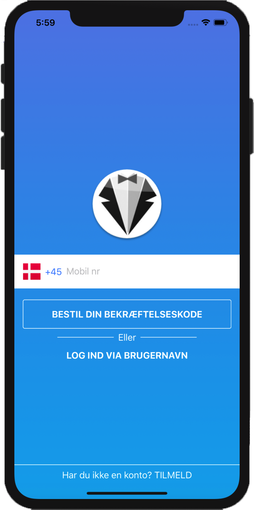
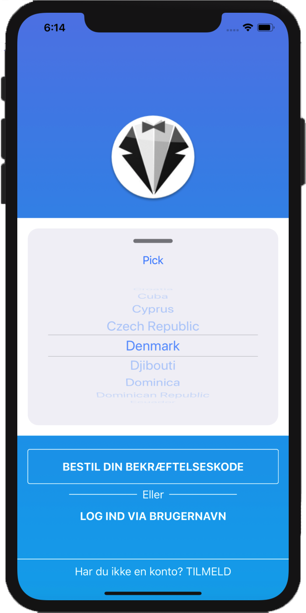

# SwiftUIPhonePicker
SwiftUIPhonePicker is a pure SwiftUI PhoneField with fancy country picker include flag, name, phonecode and animation. 
🎌 🇯🇵 🇰🇷 🇩🇪 🇨🇳 🇺🇸 🇫🇷 🇪🇸 🇮🇹 🇷🇺 🇬🇧 🏄‍♀️ 📱

## 📺 Screenshots
 

## Requirements
* iOS13.0 or later

## Install
### Swift Packages

1. In Xcode, open your project and navigate to File > Swift Packages > Add Package Dependency...
2. Paste the repository URL and follow the prompts to add the library to your project.

## Quick Start

    import SwiftUI
    import SwiftUIPhonePicker

    struct ContentView : View {
        @State private var countryCode : String? = "DK"
        @State private var phoneCode : String = "+45"
        @State private var phone : String = ""
        var body: some View {
            PhonePicker(phoneCode: self.$phoneCode,phone: self.$phone,abbr: self.$countryCode != nil ? self.$countryCode : nil,countryName: nil,placeHolder:"Fill the mobile no")
        }
    }
    
##  Future Improvments
- [x] Localization
- [x] Country search
- [x] Exclude Countries
- [x] Include Countries
- [x] Pick country from sheet
- [x] Show flag in the pick list
    
## Sponsor

This library sponsored by  <a href="https://www.DinTjener.dk">DinTjener</a>

## Author 🧑‍💻

Hamed Khosravi, H.K@dintjener.dk

If you have any issue or enhancement, Don't hesitate to contact me
